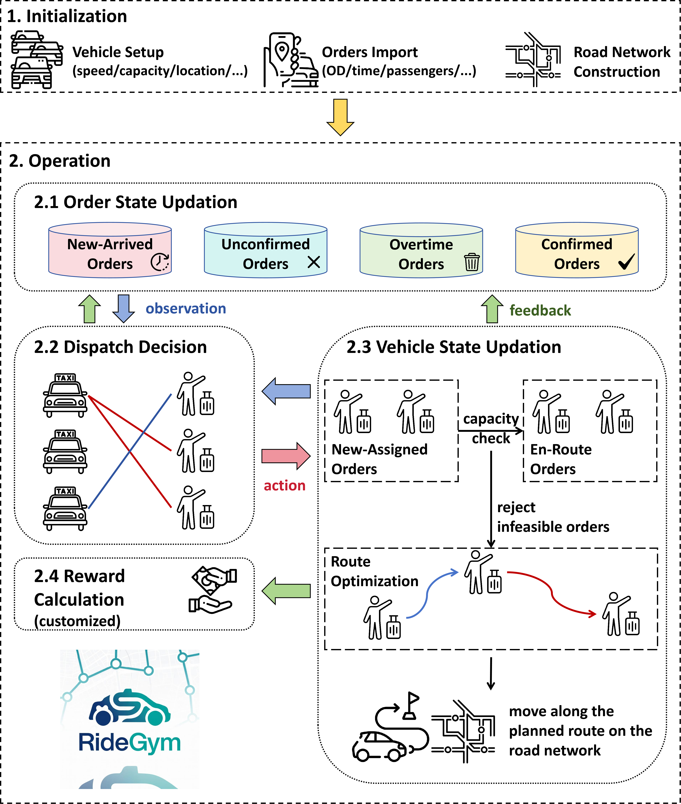

# RideGym

**Article:** Zijian Zhao, Yulong Hu, Sen Li*, "[RideGym: A Standardized Interface for Real-World Large-Scale Ride-Sharing System](https://arxiv.org/abs/2607.10173)" (in preperation)

[ride-gym · PyPI](https://pypi.org/project/ride-gym/) is a Gym-like (but not Gym-dependent) simulation environment for large-scale ride-pooling and order dispatching.



A fleet of vehicles serves a stream of ride requests that arrive over time, with realistic pooling, capacity limits, road-network routing, and impatient passengers. Each vehicle is an agent under a fully-centralized multi-agent setting: at every decision step you assign pending orders to vehicles, and the simulator handles conflict resolution, route re-planning, movement, and reward computation. The env is built from swappable components (order source, road network, route planner, reward), so you can plug in your own without touching the core loop.

---

## Contents

- [Part 1 — The `ride_gym` environment](#part-1--the-ride_gym-environment) &nbsp;(install & use the simulator)
- [Part 2 — The research benchmark](#part-2--the-research-benchmark) &nbsp;(reproduce our train / test results)
  - [Repository layout](#repository-layout)
  - [Setup](#benchmark-setup)
  - [Step A — Prepare the NYC data](#step-a--prepare-the-nyc-data)
  - [Step B — Train the RL dispatch agents](#step-b--train-the-rl-dispatch-agents)
  - [Step C — Test & compare on held-out windows](#step-c--test--compare-on-held-out-windows)

---

# Part 1 — The `ride_gym` environment

The simulator is published on PyPI and can be used entirely on its own (no benchmark code required).

## Installation

```bash
pip install ride-gym
```

The core only needs `numpy`. Install extras as needed:

```bash
pip install ride-gym[data]     # pandas/pyarrow/geopandas/osmnx: build & preprocess real demand
pip install ride-gym[osmnx]    # real OpenStreetMap road networks
pip install ride-gym[viz]      # matplotlib: rendering & animation
pip install ride-gym[all]      # everything
```

Requires Python >= 3.9.

## Quickstart

```python
from ride_gym import RidePoolEnv
from ride_gym.order_generator import RandomOrderGenerator
from ride_gym.road_network import ManhattanNetwork

# 1. Demand: your own trips, or a procedural generator.
order_gen = RandomOrderGenerator(
    area=(0.0, 0.0, 10.0, 10.0), horizon=60.0, num_orders=10000,
    arrival="poisson", max_party_size=3,
)

# 2. Road network: abstract backend, or a real OSM graph (see below).
network = ManhattanNetwork(speed=1.0)   # coordinate units per minute

# 3. Environment.
env = RidePoolEnv(
    num_drivers=1000,
    driver_capacity=4,
    dt=1.0, horizon=60.0,
    order_timeout=3.0,          # orders waiting longer than this are withdrawn
    order_generator=order_gen,
    road_network=network,
)

# 4. Roll out. obs / rewards are dicts keyed by vehicle id.
obs, info = env.reset(seed=0)
done = False
while not done:
    actions = {}
    for i, s_v in obs.items():
        pool = s_v["pending_orders"]        # orders waiting to be assigned
        order_ids = my_policy(s_v, pool)    # -> list of order ids to bid on
        actions[i] = {"orders": order_ids}  # empty list = take no order
    obs, rewards, dones, info = env.step(actions)
    done = dones["__all__"]
```

Drop your training code straight into the loop between `step` calls.

## Actions

Each vehicle's action is a small dict (the two keys are mutually exclusive):

```python
{"orders": [order_id, ...]}    # bid on pending orders (empty = take no order)
{"relocate": index_or_coord}   # idle vehicles only: reposition to a point
```

The simulator automatically enforces feasibility every step: an order goes to at most one vehicle, and a vehicle never exceeds its remaining capacity. If two vehicles bid on the same order the env raises a `ConflictError` — the upstream (central) policy must coordinate to avoid conflicts.

## Order sources

Bring your own historical trips as a table (one row per order):

```python
from ride_gym.order_generator import DataFrameOrderGenerator

# Columns: origin_x, origin_y, dest_x, dest_y, request_time, num_passengers
order_gen = DataFrameOrderGenerator(dataframe=my_orders_df)
```

or use `RandomOrderGenerator` for synthetic demand with `uniform` / `poisson` / `peak` arrivals. For the real NYC scenario ([TLC Trip Record Data - TLC](https://www.nyc.gov/site/tlc/about/tlc-trip-record-data.page)) there are also `NYCOrderGenerator` (single window) and `MultiWindowNYCOrderGenerator` (train/val/test window pools).

## Road networks

For abstract experiments, use the fast closed-form `EuclideanNetwork` or `ManhattanNetwork`. For real maps, `OSMnxNetwork` loads an OpenStreetMap graph whose all-pairs shortest paths are precomputed and cached to disk, so every distance query is an `O(1)` lookup:

```python
from ride_gym.osmnx_network import OSMnxNetwork
network = OSMnxNetwork(graph_path="data/manhattan.gpickle")
```

## Custom rewards

A `DefaultRewardFunction` modelling platform revenue and passenger satisfaction is provided. To optimize for your own criteria (waiting time, service rate, detour, ...), subclass `RewardFunction` and pass it to the env:

```python
from ride_gym import RidePoolEnv, DefaultRewardFunction
env = RidePoolEnv(..., reward_function=DefaultRewardFunction(assignment_bonus=1.0))
```

## Centralized view

For single-agent / global-optimization research, wrap the env so one policy emits all actions and gets an aggregated reward (the per-vehicle rewards are kept in `info`):

```python
from ride_gym import CentralizedWrapper
env = CentralizedWrapper(RidePoolEnv(...), aggregate="sum")
obs, reward, done, info = env.step(joint_action)
```

## Visualization

With the `[viz]` extra you can render a single frame or animate a whole episode:

```python
from ride_gym.visualize import TrajectoryRecorder, render_animation

env.render(mode="human", save_path="frame.png")   # one static frame

rec = TrajectoryRecorder()
obs, _ = env.reset(seed=0)
done = False
while not done:
    obs, rewards, dones, info = env.step(my_policy(obs))
    rec.snapshot(env)
    done = dones["__all__"]
render_animation(rec, out_path="episode.gif")     # or .mp4
```

Each vehicle is drawn in its own color, with its current location, planned route along the road network, and the origins/destinations of the orders it is serving. Aggregate plots (demand & service heatmaps, supply-demand gaps, load time series, waiting-time distributions) are also available via `ride_gym.analysis`.

---

# Part 2 — The research benchmark

This repository also contains the full **benchmark** we use to study learning-based order dispatching on a real New York City ride-pooling scenario. It provides:

- **Three RL dispatch agents** — `iddqn` (Independent Double DQN with bipartite matching, supporting the MLP/Assignment-Net/CV-Net), `mfddqn` (Mean-Field DDQN), and `bmgq` (BMG-Q, a graph-attention mean-field variant).
- **Model-based baselines** — `random_radius`, `gale_shapley`, `nearest_distance`, `hungarian`.
- **A fair evaluation harness** — every method runs through the same seeded episodes on the same held-out NYC test windows, so KPI differences reflect only the dispatch policy.

> This repository bundles the `ride_gym/` environment source together with the benchmark code (`benchmark/`, `iddqn/`, `mfddqn/`, `bmgq/`), so the benchmark runs entirely from a clone with no separate install of the environment required. (The standalone `ride_gym` package is also published on PyPI for use outside this benchmark.)

## Repository layout

```
ride_gym/            # the simulation environment (the pip package)
  data_tools/        #   NYC data-preparation CODE (no bundled data)
benchmark/           # evaluation harness: config, runner, baselines, run_test
iddqn/               # IDDQN agent + trainer
mfddqn/              # Mean-Field DDQN agent + trainer
bmgq/                # BMG-Q agent + trainer
data/                # generated data lands here (git-ignored, not shipped)
dataset/             # raw inputs you download (FHVHV parquet, taxi zones)
```

## Step A — Prepare the NYC data

The scenario is built from public NYC TLC data. Download two raw inputs into `./dataset/`:

1. **High-Volume FHV trip records** (one month, parquet) from the
   [NYC TLC Trip Record Data](https://www.nyc.gov/site/tlc/about/tlc-trip-record-data.page) page, saved as
   `./dataset/fhvhv_tripdata_2026-04.parquet` (any month works — adjust the dates in `build_splits.py`).
2. **Taxi Zone shapefile** from the same page, extracted to
   `./dataset/taxi_zones/taxi_zones.shp`.

Then build the derived assets with the `ride_gym.data_tools` command-line tools (they all write under `./data/`):

```bash
# 1. Reduce taxi-zone polygons to (lon, lat) centroids  ->  data/nyc/zone_centroids.csv
python -m ride_gym.data_tools.nyc.zone_centroids

# 2. Download & cache the Manhattan region-A road network  ->  data/nyc/manhattan.gpickle
python -m ride_gym.data_tools.nyc.build_nyc_network

# 3. (optional) Preprocess ONE order window  ->  data/nyc/orders.parquet
python -m ride_gym.data_tools.nyc.preprocess_orders

# 4. Slice raw trips into train/val/test window files + manifest  ->  data/nyc/splits/
python -m ride_gym.data_tools.nyc.build_splits            # 60-min windows (default)
```

After step 4 you should have:

```
data/nyc/manhattan.gpickle
data/nyc/zone_centroids.csv
data/nyc/splits/manifest.json
data/nyc/splits/train/window_XXXX.parquet
data/nyc/splits/val/window_XXXX.parquet
data/nyc/splits/test/window_XXXX.parquet
```

The train / val / test windows come from **disjoint day ranges**, so there is no temporal leakage. Edit `TRAIN_DAYS` / `VAL_DAYS` / `TEST_DAYS` and `DAILY_WINDOW_STARTS` at the top of `ride_gym/data_tools/nyc/build_splits.py` to match your data month and desired coverage.

## Step B — Train the RL dispatch agents

Each agent has its own trainer. Hyper-parameters and the scenario (drivers, horizon, splits, ...) live in that trainer's `TrainConfig`; run it as a module to train with the defaults:

```bash
python -m iddqn.train_iddqn      # IDDQN
python -m mfddqn.train_mfddqn    # Mean-Field DDQN
python -m bmgq.train_bmgq        # BMG-Q
```

Each run creates a timestamped directory `<algo>/runs/<algo>_YYYYmmdd_HHMMSS/` containing:

- `config.json` — the exact config used;
- `checkpoints/<algo>_ep<N>.pt` — periodic model checkpoints;
- `train_log.csv` / `eval_log.csv` — training and validation curves;
- `eval_details/` — per-episode KPI dumps.

Training periodically evaluates on the **val** split and, at the end, on the held-out **test** split, printing a KPI table against the `nearest` / `hungarian` baselines.

**Customizing a run.** The trainers are driven by a Python config, not CLI flags. Either edit the defaults in e.g. `iddqn/train_iddqn.py::TrainConfig`, or drive it programmatically:

```python
import dataclasses
from iddqn.train_iddqn import train, TrainConfig
from benchmark.config import BenchmarkConfig

cfg = TrainConfig(
    num_episodes=500,
    benchmark=dataclasses.replace(BenchmarkConfig(), num_drivers=1000, horizon=60.0),
)
train(cfg)                    # runs the full training loop
```

## Step C — Test & compare on held-out windows

Use `benchmark.run_test` to evaluate any mix of model-based baselines and trained RL checkpoints on **specific** held-out NYC test windows. Every method runs through the same seeded episode on each window, so the comparison is apples-to-apples.

**Model-based baselines only:**

```bash
python -m benchmark.run_test \
    --seed 42 \
    --baselines nearest_distance hungarian gale_shapley random_radius \
    --windows 2 10 \
    --splits-dir data/nyc/splits/test
```

**Compare several trained RL checkpoints** (each is auto-named from its filename; the RL family — iddqn/mfddqn/bmgq — is inferred from the name):

```bash
python -m benchmark.run_test \
    --seed 42 \
    --rl-ckpt iddqn/runs/<run>/checkpoints/iddqn_ep500.pt \
    --rl-ckpt mfddqn/runs/<run>/checkpoints/mfddqn_ep500.pt \
    --rl-ckpt bmgq/runs/<run>/checkpoints/bmgq_ep500.pt \
    --windows 2 10
```

Give a checkpoint an explicit display name with `--rl NAME CKPT` (repeatable), and dump per-method detailed records with `--out-dir results/test`. Run `python -m benchmark.run_test --help` for all options.

# Citation

```
@misc{zhao2026ridegym,
      title={RideGym: A Standardized Interface for Real-World Large-Scale Ride-Sharing System}, 
      author={Zijian Zhao and Yulong Hu and Sen Li},
      year={2026},
      eprint={2607.10173},
      archivePrefix={arXiv},
      primaryClass={cs.MA},
      url={https://arxiv.org/abs/2607.10173}, 
}
```

